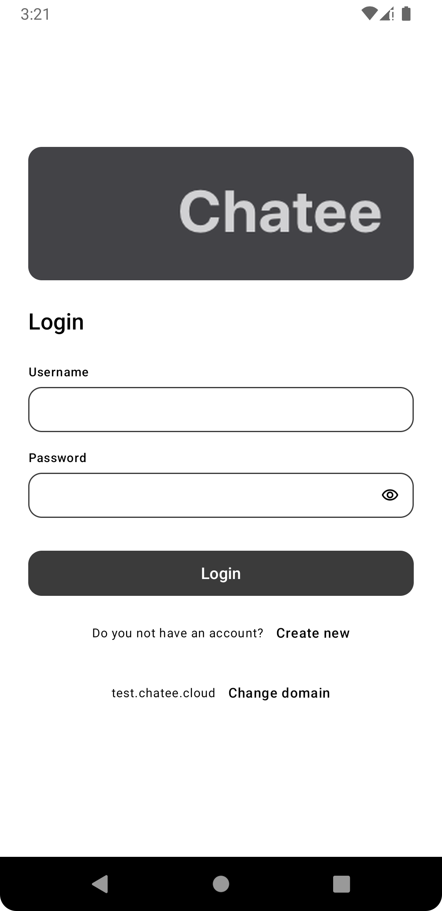
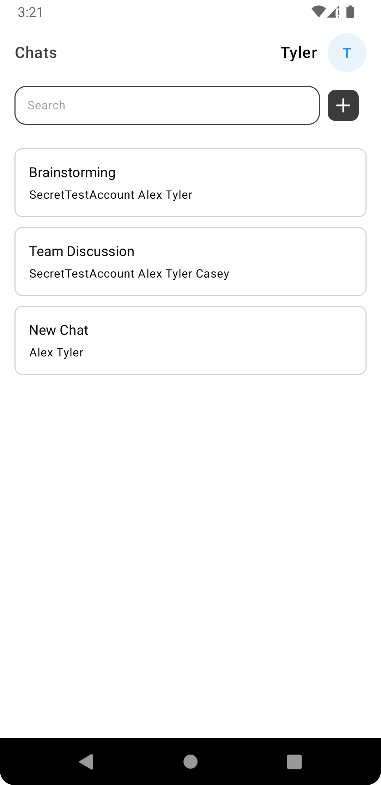
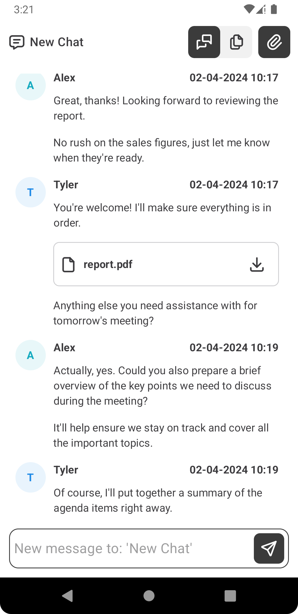

# Privmx Chatee

<p float="center">



</p>

## Basics
Chatee is a chat application that provides you with full end-to-end encryption using the [PrivMX Platform](https://privmx.cloud).

Chatee provides essential chat features, including group chats and file attachments. All data exchanged within Chatee is end-to-end encrypted, meaning that only the end users can read (decrypt) their messages. It means that even platform hosting provider cannot access user data.

Chatee differentiates three types of users:
- **Owner**, who manages domains;
- **Staff**, who manages users within a domain;
- **Regular users**, who interacts with the app.

When you create your initial account within a domain, it automatically becomes a Staff account. As a Staff user, you have the authority to invite other users and assign different permissions for app access.

All Staff users can invite others by sending them an invitation token generated inside the app. Before generating a token you can decide whether the account will have Staff permissions or be a Regular user. Regular users can create new chats only with Staff members. Staff can add chats with all the users in the server, regardless of their status.

Chat is in real-time. You can send text messages and files up to 50 MB.

## Requirements
Android Chatee requires an application server. Its configuration and launch is described in the Web Chatee project [repository](https://github.com/simplito/privmx-chatee?tab=readme-ov-file#what-do-you-need).

## How to run

1. If you do not have Github Personal Access Token (PAT), create it as described on [Github Docs](https://docs.github.com/en/authentication/keeping-your-account-and-data-secure/managing-your-personal-access-tokens).
2. Add created Github PAT to [`local.properties`](local.properties)
```text
privmxGithubMavenUsername=<your_github_username>
privmxGithubMavenPassword=<your_github_pat>
```
3. If native libraries are not installed automatically (no `app/src/main/jniLibs` directory in project) then run
```shell
./gradlew app:privmxEndpointInstallJni
```
4. Run Chatee `app` configuration.


