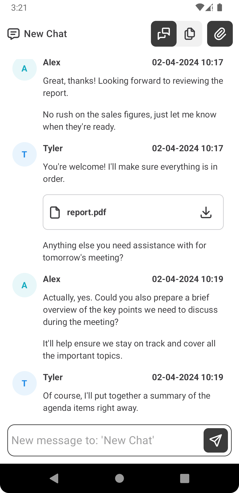

# Privmx Chatee

<p float="center">



</p>

## Basics

Chatee is a chat application that provides you with full end-to-end encryption
using [PrivMX](https://privmx.dev)
and [Privmx Endpoint Android library](https://github.com/simplito/privmx-endpoint-java/).

Chatee provides essential chat features, including group chats and file attachments. All the data
exchanged within Chatee is
end-to-end encrypted, meaning that only the end users can read (decrypt) their messages. It means
that even the platform hosting
provider cannot access user data.

Chatee categorizes users into two distinct roles:

- **Staff**: Authorized personnel who administer user accounts and permissions.
- **Regular users**: Individuals who interact with the app's features and functionalities for
  communication.

All Staff users can invite others by sending them an invitation token generated inside the app.
Before generating a
token you can decide whether the account will have Staff permissions or be a regular user. Regular
users can create new
chats only with Staff members. Staff can add chats with all the users in the server, regardless of
their status.

Chats occur in real-time. You can send text messages and files up to 50 MB.

## Requirements

Chatee backend server requires a properly configured instance of PrivMX Bridge.
Chatee backend server is available on [Github](https://github.com/simplito/privmx-chatee).
Please read the corresponding README.md file, which describes prerequisites and step by step
installations.

## How to run

1. If native libraries are not installed automatically (there is no `app/src/main/jniLibs` directory
   in the
   project) then run:

```shell
./gradlew app:privmxEndpointInstallJni
```

2. Run Chatee `app` configuration.

## Using Chatee Android App with non trusted domains

If you are using this software with Chatee server running on domain without proper SSL certificate,
you should create network configuration file as described
in [Android documentation](https://developer.android.com/privacy-and-security/security-config)
and allow cleartext traffic for your domain
using [this setting](https://developer.android.com/privacy-and-security/risks/cleartext-communications#http-mitigations).

## About PrivMX

[PrivMX](http://privmx.com) allows developers to build end-to-end encrypted apps used for
communication. The Platform works according to privacy-by-design mindset, so all of our solutions
are based on Zero-Knowledge architecture. This project extends PrivMX’s commitment to security by
making its encryption features accessible to developers using Java/Kotlin.

## License information

**PrivMX Chatee Android.**\
Copyright © 2024 Simplito sp. z o.o.

This file is part of demonstration software for the PrivMX Platform (https://privmx.dev). \
This software is Licensed under the MIT License.

PrivMX Endpoint and PrivMX Bridge are licensed under the PrivMX Free License.\
See the License for the specific language governing permissions and limitations under the License.


